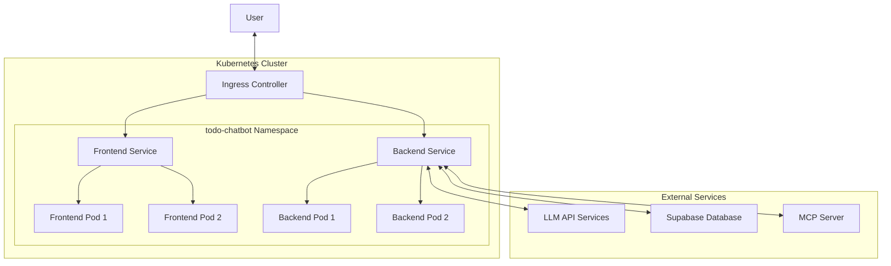

# 🚀 AI Agentixz USA — Phase IV Kubernetes Deployment

[](https://nextjs.org/)
[](https://fastapi.tiangolo.com/)
[](https://supabase.com/)
[](https://kubernetes.io/)
[](https://helm.sh/)
[](https://docker.com/)

**AI Agentixz USA** has evolved to include enterprise-grade container orchestration with **Kubernetes**. This Phase IV implementation delivers cloud-native deployment capabilities, ensuring scalability, resilience, and operational excellence for your elite productivity needs.

---

## 🌟 Phase IV Feature Suite

### 🏗 Container Orchestration Layer
- **Docker Containerization**: Multi-stage builds for both frontend (Next.js) and backend (FastAPI) with optimized image sizes
- **Kubernetes Native**: Full Kubernetes manifests for deployments, services, and ingress management
- **Helm Charts**: Production-ready Helm chart for simplified deployment and lifecycle management
- **Auto-Scaling**: Horizontal Pod Autoscaling based on CPU utilization for elastic capacity

### ⚡ Cloud-Native Operations
- **Minikube Integration**: Local development cluster setup with single-command deployment
- **Service Discovery**: Internal communication between frontend and backend services
- **Ingress Management**: External access routing with path-based load balancing
- **Health Monitoring**: Built-in liveness and readiness probes for self-healing capabilities

### 🔐 Enterprise Security
- **Secrets Management**: Kubernetes Secrets for API keys and sensitive configuration
- **ConfigMaps**: Centralized configuration management for non-sensitive data
- **Resource Quotas**: CPU and memory limits to prevent resource exhaustion
- **Network Policies**: (Optional) Isolated service communication patterns

---

## 🏗 System Architecture (Kubernetes Edition)



---

## 🚀 Kubernetes Deployment Guide

### Prerequisites
- **Docker Desktop** or **Docker Engine** (v24.0+)
- **kubectl** (v1.25+)
- **Helm 3** (v3.10+)
- **Minikube** (for local) or access to Kubernetes cluster

### 1. Local Deployment with Minikube

```bash
# Start Minikube cluster
minikube start --cpus=4 --memory=8192 --disk-size=20g

# Enable required addons
minikube addons enable ingress
minikube addons enable metrics-server

# Build Docker images
cd frontend && docker build -t todo-chatbot-frontend:latest . && cd ..
cd backend && docker build -t todo-chatbot-backend:latest . && cd ..

# Load images into Minikube
minikube image load todo-chatbot-frontend:latest
minikube image load todo-chatbot-backend:latest

# Deploy using Helm
helm upgrade --install todo-chatbot ./charts/todo-chatbot \
    --namespace todo-chatbot \
    --create-namespace \
    --set global.namespace=todo-chatbot \
    --set frontend.image.repository=todo-chatbot-frontend \
    --set frontend.image.tag=latest \
    --set backend.image.repository=todo-chatbot-backend \
    --set backend.image.tag=latest
```

### 2. Using the Automated Setup Script

```bash
# Run the complete setup script
./scripts/minikube-setup.sh
```

### 3. Access the Application

Add Minikube IP to hosts file:
```bash
echo "$(minikube ip) todo-chatbot.local" | sudo tee -a /etc/hosts
```

Access at: http://todo-chatbot.local

---

## 📦 Helm Chart Configuration

The Helm chart includes the following configurable parameters:

### Frontend Configuration
```yaml
frontend:
  replicaCount: 1
  image:
    repository: todo-chatbot-frontend
    tag: latest
    pullPolicy: IfNotPresent
  service:
    type: ClusterIP
    port: 80
  resources:
    limits:
      cpu: 200m
      memory: 256Mi
    requests:
      cpu: 100m
      memory: 128Mi
  autoscaling:
    enabled: true
    minReplicas: 1
    maxReplicas: 5
    targetCPUUtilizationPercentage: 70
```

### Backend Configuration
```yaml
backend:
  replicaCount: 1
  image:
    repository: todo-chatbot-backend
    tag: latest
    pullPolicy: IfNotPresent
  service:
    type: ClusterIP
    port: 80
  resources:
    limits:
      cpu: 500m
      memory: 512Mi
    requests:
      cpu: 250m
      memory: 256Mi
  autoscaling:
    enabled: true
    minReplicas: 1
    maxReplicas: 10
    targetCPUUtilizationPercentage: 70
```

### External Service Configuration
```yaml
external:
  supabase:
    url: ""
    key: ""
    anonKey: ""
  auth:
    jwtSecretKey: ""
    betterAuthSecret: ""
  ai:
    openaiApiKey: ""
    openrouterApiKey: ""
    groqApiKey: ""
    geminiApiKey: ""
  database:
    url: ""
```

---

## 🛠 Advanced Deployment Operations

### Custom Values File Deployment
Create a `production-values.yaml` file with your environment-specific configurations:

```bash
# Deploy with custom values
helm upgrade --install todo-chatbot ./charts/todo-chatbot \
    --namespace todo-chatbot-prod \
    --create-namespace \
    -f production-values.yaml
```

### Using the Deployment Script
```bash
# Deploy application
./scripts/deploy.sh deploy

# Check status
./scripts/deploy.sh status

# View logs
./scripts/deploy.sh logs frontend
./scripts/deploy.sh logs backend

# Scale deployments
./scripts/deploy.sh scale frontend 3
./scripts/deploy.sh scale backend 2

# Upgrade application
./scripts/deploy.sh upgrade

# Rollback application
./scripts/deploy.sh rollback
```

---

## 🔍 Monitoring and Management

### Check Deployment Status
```bash
# Helm release status
helm status todo-chatbot --namespace todo-chatbot

# Kubernetes resources
kubectl get all -n todo-chatbot

# Ingress configuration
kubectl get ingress -n todo-chatbot
```

### Resource Scaling
```bash
# Manual scaling
kubectl scale deployment todo-chatbot-frontend -n todo-chatbot --replicas=3
kubectl scale deployment todo-chatbot-backend -n todo-chatbot --replicas=3

# Check HPA status
kubectl get hpa -n todo-chatbot
```

---

## 🛡 Security Considerations

1. **Secrets Management**: All sensitive data (API keys, database credentials) stored in Kubernetes Secrets
2. **Image Security**: Use non-root users in containers and scan images for vulnerabilities
3. **Resource Limits**: Set appropriate CPU and memory limits to prevent resource exhaustion
4. **Network Security**: (Optional) Implement Network Policies for service isolation

---

## 🚀 Production Deployment

For production environments:

1. Push Docker images to a secure registry (Docker Hub, AWS ECR, GCR, etc.)
2. Configure external load balancer instead of Minikube ingress
3. Implement SSL certificates for HTTPS
4. Set up monitoring and alerting (Prometheus, Grafana)
5. Configure backup strategies for persistent data

---

## 🤖 MCP Tool Library (Kubernetes-Ready)

All MCP tools remain fully functional in the Kubernetes environment:
- `add_todo` - Deploys new objectives with proper load balancing
- `add_todos_bulk` - Batch operations distributed across pod replicas
- `list_todos` - Synchronized across all instances
- `toggle_todo` - State management with database consistency
- `manage_timer` - Distributed timing with centralized database
- `delete_todo` - Consistent deletion across the cluster

---

## 📊 Performance & Scalability

- **Auto-Scaling**: Horizontal Pod Autoscaling based on CPU utilization
- **Load Distribution**: Kubernetes Service load balancing across pod replicas
- **Resource Optimization**: Multi-stage Docker builds with optimized layer caching
- **Health Checks**: Built-in liveness and readiness probes for self-healing

---

## ✍️ Phase IV Credits

**Phase IV Status**: **Kubernetes Deployment Complete** 🚀🇺🇸
- **Kubernetes Orchestration**: Complete container deployment solution
- **Helm Charts**: Production-ready packaging and deployment
- **CI/CD Ready**: Infrastructure as Code implementation
- **Cloud-Native**: Scalable, resilient, and maintainable architecture